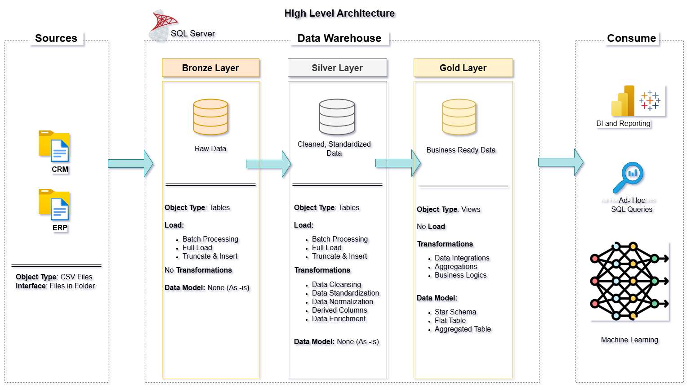

# 📊 Data Warehouse and Analytics Project

Welcome to the **Data Warehouse and Analytics Project** repository! 🗃️  
This project demonstrates a full-scale **Data Warehouse** implementation using **SQL Server**, focusing on modern data engineering, data modeling, and analytics. Designed as a portfolio project, it follows industry best practices to solve real-world problems with data.

---

## Project Requirements

### Building the Data Warehouse (Data Engineering)

#### 🎯 Objective  
Develop a modern **data warehouse** using **SQL Server** to consolidate and analyze **sales data**, empowering stakeholders with insights for better decision-making.

##### 📝 Project Specifications  
- **Data Sources**: Import data from two source systems (**ERP** and **CRM**) provided as CSV files.  
- **Data Quality**: Cleanse the raw data and address quality issues before analysis.  
- **Integration**: Combine data from both source systems into a unified, user-friendly data model optimized for analytical queries.  
- **Scope**: Focus on the most recent dataset (historization of data is not required).  
- **Documentation**: Provide clear, concise documentation on the data model for both business stakeholders and analytics teams.

---

### BI: Analytics & Reporting (Data Analytics)

#### 🎯 Objective  
Develop SQL-based analytics to generate actionable business insights, focusing on:
- **Customer Behavior**
- **Product Performance**
- **Sales Trends**

These insights will allow stakeholders to make data-driven decisions and improve business outcomes.

---

## 📦 Project Overview

This solution illustrates the process of building a modern data warehouse using **SQL Server**, covering the complete data pipeline from raw data ingestion to actionable business insights. The project is divided into the following stages:

---

### 🔄 ETL (Extract, Transform, Load)
- Automates data extraction from multiple source systems.  
- Transforms and cleanses the data into a unified, analysis-ready format.  
- Loads the processed data into the data warehouse for use in analytics.

---

### 🧱 Data Modeling
- Implements **dimensional modeling** using **star** and **snowflake schemas** to optimize data for analytics.  
- Designed for scalability and performance to handle large datasets efficiently.

---

### 📈 Analytics & Reporting
- Enables detailed SQL-based analysis for business insights.  
- Supports integration with BI tools for interactive dashboards and reports.  
- Focuses on providing real-time, actionable insights from both historical and current data.

---

## 🏗️ Data Architecture Diagram

To help visualize the flow of data from the source systems to the final reports, here is a **Data Architecture Diagram** outlining the various layers of the project:

- **Source Systems (ERP/CRM)**: Raw data from the source systems, typically provided in CSV files.
- **Bronze Layer**: Raw, untransformed data ingested into the warehouse.
- **Silver Layer**: Cleansed, transformed data ready for analytical queries.
- **Gold Layer**: Enriched, business-ready data used for reporting and analytics.

---

### 📄 License
This project is licensed under the [MIT License](LICENSE).

---

## 🧑‍💻 About Me

Hi! I’m **Manish Shrivastav**, a data-driven software engineer and machine learning practitioner with a Ph.D. in Agricultural Engineering (Statistics minor). With extensive experience in developing scalable data platforms and applying advanced analytics, I’ve designed and implemented a modern **data warehouse** using **SQL Server** in this project. My goal is to help businesses transform raw data into valuable insights for better decision-making.

---

Feel free to explore the repository and reach out with any questions. Happy analyzing! 📊
